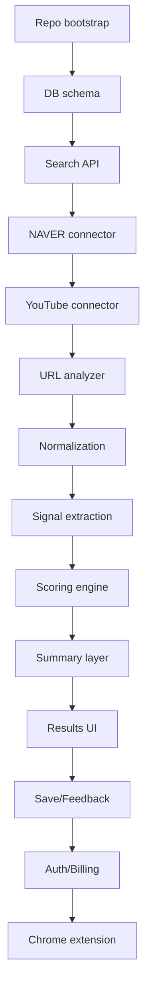

# 신뢰도 기반 구매 리서치 에이전트 - 구현 워크플로우 체크리스트
### Version 1.0
### 목적: Codex / Gemini / Claude / 개발팀 실행용

---

## 1. 구현 순서 개요



---

## 2. Epic 단위 백로그

## Epic 1 - Repo / Infra Bootstrap
### 목표
- 로컬에서 웹 + API + DB + Redis가 뜨는 상태 만들기

### 작업
- [ ] monorepo 생성
- [ ] apps/web 생성
- [ ] services/api 생성
- [ ] services/worker 생성
- [ ] docker compose for postgres/redis
- [ ] .env.example 작성
- [ ] lint / format / typecheck 설정
- [ ] CI 기본 파이프라인 설정

### 완료 기준
- [ ] `pnpm dev` 또는 동등 명령으로 웹/백엔드 실행 가능
- [ ] `/health` 응답 정상
- [ ] DB 연결 정상
- [ ] Redis 연결 정상

---

## Epic 2 - Domain Schema / DB
### 목표
- 검색/결과/신호/점수/저장 구조를 DB에 반영

### 작업
- [ ] users 테이블
- [ ] query_jobs 테이블
- [ ] expanded_queries 테이블
- [ ] source_results 테이블
- [ ] extracted_signals 테이블
- [ ] score_cards 테이블
- [ ] claim_clusters 테이블
- [ ] collections / collection_items 테이블
- [ ] feedback_events 테이블
- [ ] url_analysis_jobs 테이블
- [ ] migration 스크립트
- [ ] seed script

### 완료 기준
- [ ] migration up/down 동작
- [ ] 주요 인덱스 설정
- [ ] ORM 모델 또는 Pydantic schema 정리 완료

---

## Epic 3 - Search Job Orchestrator
### 목표
- 검색 요청을 job으로 생성하고 비동기로 처리

### 작업
- [ ] POST /api/search 구현
- [ ] GET /api/search/{job_id} 구현
- [ ] Job 상태 모델: queued/running/completed/failed
- [ ] progress 구조 정의
- [ ] connector fan-out 구조 구현
- [ ] partial result 저장 구조 구현
- [ ] timeout/retry 정책 적용

### 완료 기준
- [ ] 검색 요청 후 job_id 반환
- [ ] 폴링 시 진행 상태 조회 가능
- [ ] 일부 커넥터 실패에도 전체 job 유지

---

## Epic 4 - Query Expansion Engine
### 목표
- 사용자 입력을 카테고리별 하위 질의로 확장

### 작업
- [ ] normalize_input 함수
- [ ] entity extraction 함수
- [ ] category classifier
- [ ] category keyword dictionary
- [ ] ko/en query generator
- [ ] source-specific query planner

### 완료 기준
- [ ] 입력 1개당 최소 8~15개 하위 질의 생성
- [ ] 카테고리별 확장어 차등 적용
- [ ] 테스트 케이스 작성

---

## Epic 5 - Connector: NAVER
### 목표
- NAVER Search API 기반 검색 결과 수집

### 작업
- [ ] blog search adapter
- [ ] cafe search adapter
- [ ] news search adapter
- [ ] web search adapter
- [ ] shopping search adapter
- [ ] rate limit / error handling
- [ ] raw payload 저장

### 완료 기준
- [ ] 검색어 기준 결과 수집 가능
- [ ] 공통 스키마로 정규화 가능
- [ ] 실패 로그 확인 가능

---

## Epic 6 - Connector: YouTube
### 목표
- YouTube 검색 결과 수집

### 작업
- [ ] video search adapter
- [ ] metadata extraction
- [ ] channel/title/description/snippet mapping
- [ ] comment summary optional stub
- [ ] raw payload 저장

### 완료 기준
- [ ] 제품 검색 시 영상 결과 수집 가능
- [ ] 영상 메타데이터가 공통 스키마에 저장됨

---

## Epic 7 - URL Analyzer
### 목표
- 사용자가 붙여 넣은 URL 하나를 분석

### 작업
- [ ] POST /api/analyze-url
- [ ] GET /api/analyze-url/{job_id}
- [ ] 허용 도메인 정책
- [ ] SSRF 방지
- [ ] HTML fetcher
- [ ] content extraction
- [ ] metadata extraction
- [ ] fail-safe error message

### 완료 기준
- [ ] 유효 URL은 분석 job 생성 가능
- [ ] 본문 추출 결과 저장 가능
- [ ] 실패 이유가 사용자에게 설명됨

---

## Epic 8 - Result Normalization / Dedup
### 목표
- 플랫폼별 결과를 공통 구조로 통합하고 중복 제거

### 작업
- [ ] common result schema 구현
- [ ] canonical URL resolver
- [ ] duplicate matcher
- [ ] source native id mapping
- [ ] merge policy 정의

### 완료 기준
- [ ] 동일 결과 중복 노출 감소
- [ ] 플랫폼 간 필드가 공통 UI에서 사용 가능

---

## Epic 9 - Signal Extraction
### 목표
- 광고성/실사용/출처 신호를 추출

### 작업
- [ ] disclosure rule set
- [ ] affiliate link detector
- [ ] coupon/code detector
- [ ] CTA phrase detector
- [ ] first-person usage detector
- [ ] usage-duration detector
- [ ] pros/cons balance detector
- [ ] purchase/refund/AS mention detector
- [ ] source generality heuristic

### 완료 기준
- [ ] 각 결과에 최소 1개 이상 신호 또는 null reason 부여
- [ ] extracted_signals 테이블 저장
- [ ] 디버그 로그 가능

---

## Epic 10 - Scoring Engine
### 목표
- 신호를 기반으로 점수 계산

### 작업
- [ ] CRS 계산 함수
- [ ] EQS 계산 함수
- [ ] SCS 계산 함수
- [ ] COS 계산 함수
- [ ] TSS 계산 함수
- [ ] explanation_json 생성
- [ ] threshold label mapping

### 완료 기준
- [ ] 각 결과에 score_cards 생성
- [ ] 점수 근거 JSON 생성
- [ ] UI에서 label 변환 가능

---

## Epic 11 - Claim Clustering / Summary
### 목표
- 반복되는 장단점과 주의 포인트 요약

### 작업
- [ ] sentence extraction
- [ ] claim normalization
- [ ] embedding or lexical clustering
- [ ] positive/negative separation
- [ ] contradictory claim handling
- [ ] query-level summary writer
- [ ] result-level summary writer

### 완료 기준
- [ ] 검색 결과 상단 요약 블록 생성
- [ ] 장점/단점/주의 포인트 자동 표시
- [ ] 근거 없는 단정 문장 없음

---

## Epic 12 - Web UI
### 목표
- 실제 사용 가능한 검색/결과 화면 제공

### 작업
- [ ] home screen
- [ ] search input
- [ ] loading state / skeleton
- [ ] results list
- [ ] filters
- [ ] sort controls
- [ ] detail drawer
- [ ] summary block
- [ ] save button
- [ ] feedback button
- [ ] empty / error state

### 완료 기준
- [ ] 모바일/데스크탑 기본 반응형
- [ ] 검색 -> 결과 -> 상세 보기 흐름 정상
- [ ] UX가 3클릭 이내로 이해 가능

---

## Epic 13 - Save / Collection / Feedback
### 목표
- 재방문과 학습 루프 확보

### 작업
- [ ] save result
- [ ] create collection
- [ ] add note
- [ ] tag
- [ ] compare candidate selection
- [ ] feedback event API
- [ ] feedback UI

### 완료 기준
- [ ] 저장한 결과 재조회 가능
- [ ] 피드백이 DB에 적재됨

---

## Epic 14 - Auth / Billing
### 목표
- 무료/유료 플랜 분기

### 작업
- [ ] auth integration
- [ ] guest mode policy
- [ ] rate limit by user
- [ ] plan tier model
- [ ] billing page
- [ ] stripe subscription
- [ ] feature flag gating

### 완료 기준
- [ ] 비로그인 검색 가능
- [ ] 저장/히스토리/비교는 로그인 및 플랜에 따라 제한 가능

---

## Epic 15 - Chrome Extension
### 목표
- 현재 페이지 분석 오버레이 제공

### 작업
- [ ] manifest
- [ ] domain allowlist
- [ ] content script
- [ ] page metadata extraction
- [ ] web app handoff link
- [ ] local loading badge
- [ ] detail side panel

### 완료 기준
- [ ] 네이버 블로그/유튜브/쇼핑 페이지 등 허용 도메인에서 오버레이 동작
- [ ] 현재 페이지 분석 결과를 웹 앱으로 이어서 볼 수 있음

---

## 3. 기술적 구현 순서 추천

### Week 1
- Repo bootstrap
- DB schema
- Search API skeleton
- Home / Search UI skeleton

### Week 2
- Query expansion
- NAVER connector
- YouTube connector
- Result normalization

### Week 3
- Signal extraction
- Scoring engine
- Summary block
- Detail drawer

### Week 4
- URL analyzer
- Save / feedback
- Polish / observability / staging deploy

---

## 4. QA 체크리스트

### 검색
- [ ] 빈 검색어 처리
- [ ] 한글/영문 혼합 검색어 처리
- [ ] 오타가 있는 검색어 처리
- [ ] 소스 일부 실패 시 부분 결과 표시

### 결과
- [ ] 점수와 배지 일치
- [ ] 필터 동작
- [ ] 정렬 동작
- [ ] 상세 근거 펼침 동작

### URL 분석
- [ ] 허용 URL 정상
- [ ] 비허용 URL 차단
- [ ] 추출 실패 안내

### 저장
- [ ] 비로그인 상태 제한
- [ ] 저장/삭제
- [ ] 컬렉션 이동

### 법적/표현
- [ ] "가짜" 같은 단정 표현 없음
- [ ] 자동 추정 결과 고지 있음
- [ ] 개인정보 노출 없음

---

## 5. 추천 초기 Definition of Done

- 검색어 1개 입력 시 10초 내 의미 있는 첫 결과가 보인다.
- 상단에 장점/단점/주의 포인트가 나온다.
- 결과 카드마다 신뢰 근거가 보인다.
- 사용자는 저장 또는 원문 클릭을 할 수 있다.
- 사용자 제공 URL도 분석할 수 있다.
- API 키 누락, 소스 실패, 추출 실패 등 예외 상황이 사용자에게 자연스럽게 안내된다.

---

## 6. 에이전트 코딩 시 주의사항

- 실제 소스 접근은 공식 API 또는 사용자 제공 URL 위주로 구현
- 원문 전체 저장보다 링크/스니펫/추출 신호 중심
- 점수는 설명 가능해야 함
- LLM 요약은 source-backed only
- 실패하는 소스가 있어도 전체 검색 경험은 유지
- 모든 기능보다 먼저 검색 파이프라인 완성

---

## 7. 가장 먼저 구현해야 할 파일 후보

```text
apps/web/app/page.tsx
apps/web/app/search/[jobId]/page.tsx
services/api/app/main.py
services/api/app/routes/search.py
services/api/app/routes/analyze_url.py
services/api/app/services/query_expander.py
services/api/app/services/scoring.py
services/api/app/connectors/naver.py
services/api/app/connectors/youtube.py
services/api/app/services/normalizer.py
services/api/app/services/signal_extractor.py
services/api/app/services/summarizer.py
services/api/app/models/*.py
services/worker/app/tasks/search_job.py
packages/shared-types/src/index.ts
```

---

## 8. 마지막 실행 순서 요약

1. 검색이 돌아가게 만든다.
2. 결과를 정규화한다.
3. 신호를 뽑는다.
4. 점수를 계산한다.
5. 근거와 함께 보여준다.
6. 저장/피드백을 붙인다.
7. 그 다음에야 결제와 확장을 붙인다.
