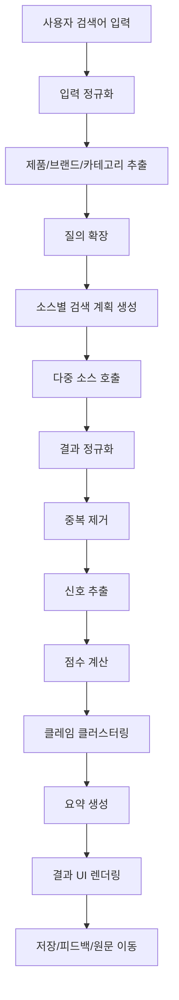
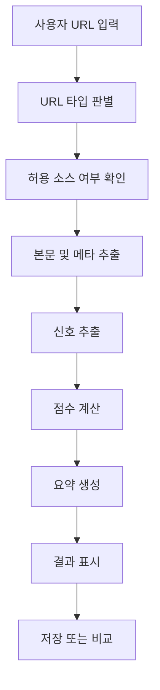
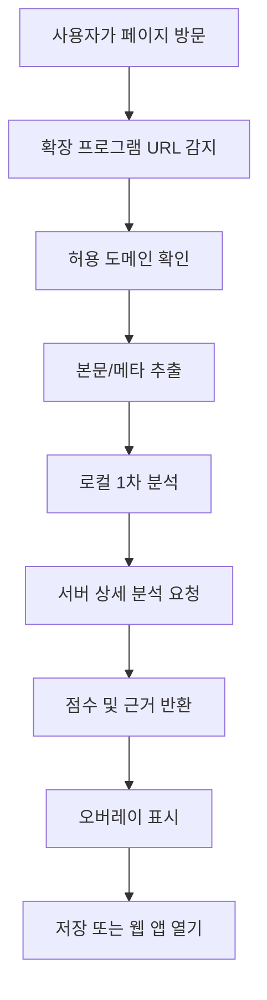

# 신뢰도 기반 구매 리서치 에이전트 - 실제 개발용 PRD + Workflow
### Version 1.0
### 작성일: 2026-03-02
### 용도: Codex / Gemini / Claude / 개발팀 / 디자이너 / PM 핸드오프

---

## 0. 문서 목적

이 문서는 아래를 한 번에 전달하기 위한 **실제 개발용 PRD(Product Requirements Document)** 이다.

- 제품의 최종 포지셔닝
- MVP 범위
- 화면 구조
- 검색 로직
- 점수 산식
- API 및 데이터 스키마
- 엔지니어링 워크플로우
- 합법적 개발 가드레일
- 1차 수익 모델
- 스프린트 단위 구현 우선순위

이 제품은 **"진짜 내돈내산 판결기"** 가 아니다.  
이 제품은 **"광고/협찬 가능성이 낮고, 근거가 투명한 후기들을 우선 탐색하고 정리해 주는 신뢰도 기반 구매 리서치 에이전트"** 이다.

---

## 1. 제품 한 줄 정의

사용자가 제품명만 입력하면, 시스템이 자동으로 검색 질의를 확장하고 여러 소스에서 결과를 모아,  
**광고성 신호**, **사용 경험 신호**, **출처 신뢰도**, **멀티소스 일치도** 를 기반으로  
후기들을 정렬하고 요약해 주는 AI 리서치 에이전트.

---

## 2. 문제 정의

### 2.1 현재 사용자 행동
사용자는 제품을 사기 전에 아래를 반복한다.

1. 제품명 검색
2. `후기`, `리뷰`, `내돈내산`, `실사용`, `단점`, `비교`, `불량` 같은 조합을 여러 번 검색
3. 네이버, 유튜브, SNS, 커뮤니티, 쇼핑 리뷰를 따로 확인
4. 광고 같은 글을 걸러내려고 다시 비교
5. 결론이 안 나서 다시 검색

### 2.2 사용자가 겪는 핵심 고통
- 정보는 많지만 흩어져 있음
- 광고/협찬/제휴/공구 글을 구분하기 어려움
- 동일 제품에 대한 장단점이 서로 달라서 판단 피로가 큼
- 구매 전 리서치 시간이 과도하게 길어짐

### 2.3 제품이 해결해야 하는 것
- 여러 플랫폼을 돌아다니는 반복 행동을 줄일 것
- 후기의 "진짜 여부"를 단정하지 말고, **신뢰도와 근거**를 보여줄 것
- 한 번의 입력으로 탐색, 요약, 비교, 저장까지 이어질 것

---

## 3. 제품 원칙

1. **판정하지 말고 정렬하라**
   - "가짜다", "조작이다", "사기다" 같은 단정 금지
   - "광고 가능성 높음", "근거 부족", "실사용 신호 강함" 같은 추정 표현 사용

2. **원문보다 근거를 우선 보여라**
   - 요약만 보여주지 말고 왜 그런 판단이 나왔는지 근거를 함께 노출

3. **모든 플랫폼을 한 번에 욕심내지 말라**
   - 공식 API 가능 소스 + 사용자 제공 링크 + 현재 보고 있는 페이지 분석으로 시작

4. **원문 저장보다 링크와 요약 중심으로**
   - 저작권/약관/리스크 최소화

5. **사용자 시간을 아껴 주는 것이 핵심 가치다**
   - "더 많이 긁어오는 것"이 아니라 "더 빨리 판단 가능한 결과"가 핵심

---

## 4. 목표와 비목표

## 4.1 목표
- 제품명 하나로 여러 소스 검색을 자동 수행
- 후기들을 공통 구조로 정규화
- 광고성 신호와 사용 경험 신호를 추출
- 신뢰도 점수와 근거를 함께 제시
- 검색 결과를 저장/비교/공유 가능하게 제공
- 법적 리스크를 낮춘 구조로 MVP 출시

## 4.2 비목표
- "100% 진짜 후기 판별" 약속
- 전 플랫폼 대량 크롤링
- 특정 작성자/브랜드 블랙리스트 운영
- 인플루언서 고발/저격 기능
- 비공개 영역 우회 수집
- 초기에 네이티브 모바일 앱 우선 개발

---

## 5. 대상 사용자

### Persona A - 구매 전 리서치가 많은 일반 소비자
- 전자제품, 화장품, 패션, 식품 구매 전 후기 탐색을 많이 함
- 여러 플랫폼을 번갈아 검색하는 습관이 있음
- 광고/협찬 글을 싫어함
- 빠른 요약보다 "믿을 만한 근거"를 원함

### Persona B - 정보 과부하를 느끼는 헤비 유저
- 구매 전 비교를 오래 하는 편
- 제품별 장단점, 불량 이슈, 실사용 후기까지 깊게 봄
- 검색 결과 저장과 비교 기능이 중요함

### Persona C - 향후 B2B 사용자
- 브랜드/셀러/리서치팀/콘텐츠팀
- 실제 사용자 반응과 광고성 콘텐츠의 차이를 보고 싶어함
- 다만 MVP에서는 직접 타겟팅하지 않음. 데이터 구조만 열어 둔다.

---

## 6. 핵심 JTBD (Jobs To Be Done)

- "나는 제품을 사기 전에 광고 같은 글 말고 실제 사용자 반응을 빨리 보고 싶다."
- "나는 여러 플랫폼을 다니며 반복 검색하는 시간을 줄이고 싶다."
- "나는 한눈에 장점, 단점, 이슈, 주의 포인트를 정리해서 보고 싶다."
- "나는 나중에 다시 볼 만한 후기들을 저장하고 비교하고 싶다."

---

## 7. 추천 시작 채널

### 결론
**웹 앱 먼저 -> 크롬 확장 추가 -> 모바일 앱은 후순위**

### 이유
- 웹 앱이 검색 허브, 저장, 로그인, 결제, SEO, 공유에 가장 유리
- 크롬 확장은 사용자가 이미 보고 있는 페이지에서 즉시 분석/저장 가능
- 모바일 앱은 후기 소비 맥락상 중요하지만, 초기엔 유지비와 개발 범위가 커짐

---

## 8. MVP 범위

## 8.1 P0 - 반드시 구현
1. 검색 입력
2. 자동 질의 확장
3. 다중 소스 검색
4. 결과 정규화
5. 광고성/사용경험/출처 신호 추출
6. 점수 계산
7. 결과 요약 및 근거 카드 표시
8. 결과 저장
9. 사용자 피드백 수집
10. 사용자 제공 URL 분석

## 8.2 P1 - MVP 이후 바로 붙일 것
1. 크롬 확장 오버레이
2. 비교 보기
3. 컬렉션 폴더
4. 검색 히스토리
5. 계정 로그인
6. 유료 플랜 게이트

## 8.3 P2 - 나중에 검토
1. 모바일 앱
2. B2B 대시보드
3. 알림/가격 추적
4. 장기 사용자 프로필 기반 추천
5. 더 많은 소스 커넥터

---

## 9. 소스 전략

## 9.1 Search Mode
공식 API 또는 합법적 검색이 가능한 소스에 대해 다중 질의 수행

초기 대상:
- NAVER Search API
  - 블로그
  - 카페글
  - 뉴스
  - 웹문서
  - 쇼핑
- YouTube Data API
- 일반 웹 검색(사용 가능 범위 안에서)
- X는 비용/정책 확인 후 선택

## 9.2 Paste-link Mode
전면 검색보다 **사용자가 URL을 붙여 넣었을 때만** 분석

초기 대상:
- Instagram URL
- Threads URL
- X URL
- 네이버 블로그/카페 URL
- 기사/리뷰 페이지 URL
- 쇼핑 상세 페이지 URL

## 9.3 Page-overlay Mode
사용자가 이미 보고 있는 페이지 위에서 분석 결과를 보여줌

초기 대상:
- 네이버 블로그
- 유튜브 영상 페이지
- 쇼핑 상세 페이지
- 후기 페이지

---

## 10. 성공 지표

### North Star Metric
- **Useful Research Session Rate**
- 정의: 사용자가 검색 후 1개 이상 결과를 저장하거나 원문 클릭을 하고, 요약 카드에 긍정 피드백을 남긴 세션 비율

### 보조 지표
- 검색 완료율
- 검색당 평균 시간
- 첫 결과 표시 시간(TTFI)
- 저장률
- 비교 보기 진입률
- 원문 클릭률
- 재방문율(7일, 30일)
- 피드백 긍정 비율
- URL 분석 사용률
- 유료 전환율(후기 단계)

---

## 11. UX / 화면 구조

## 11.1 Screen 1 - Home / Search
목표: 사용자가 한 번의 입력으로 탐색을 시작

### 요소
- 상단 로고 + 한 줄 가치 제안
- 중앙 검색 입력
- 예시 검색어 칩
- 최근 검색어
- "URL 붙여 넣기 분석" 탭
- 하단에 "어떻게 판단하는지" 간단 설명

### CTA
- "검색"
- "URL 분석"

---

## 11.2 Screen 2 - Search Results
목표: 한 화면에서 요약과 근거와 원문 이동을 제공

### 레이아웃
- 좌측: 검색어, 필터, 정렬
- 중앙: 요약 카드 + 결과 리스트
- 우측: 장점/단점/주의 포인트/광고성 신호 요약

### 상단 Summary Block
- 제품명
- 전체 신뢰도 인사이트 문장
- 많이 언급된 장점 TOP 3
- 많이 언급된 단점 TOP 3
- 주의해야 할 상업성 패턴
- 결과 소스 수
- 분석 시간

### Result Card 필드
- 제목
- 플랫폼
- 작성자/채널명
- 작성일
- 스니펫
- 광고성 신호 배지
- 실사용 신호 배지
- 출처 신뢰도 배지
- 총점
- 저장 버튼
- 원문 보기 버튼
- "왜 이렇게 점수가 나왔나" 펼침

### 필터
- 플랫폼
- 최근순
- 실사용 신호 높은 순
- 광고 가능성 낮은 순
- 영상만 / 글만 / 이미지 포함
- 기간

---

## 11.3 Screen 3 - Source Detail Drawer
목표: 각 결과의 근거를 투명하게 설명

### 내용
- 원문 메타정보
- 추출된 광고성 신호 목록
- 추출된 실사용 신호 목록
- 핵심 주장 클러스터
- 모델 요약
- 원문 이동 링크
- 신고/피드백

---

## 11.4 Screen 4 - Compare View
목표: 저장한 2~5개 결과를 비교

### 비교 컬럼
- 플랫폼
- 작성자 일반성
- 상업성 신호
- 사용 기간 언급
- 장점
- 단점
- 구매/배송/AS 언급
- 총점
- 메모

---

## 11.5 Screen 5 - URL Analyze
목표: 사용자가 특정 링크 하나만 넣어도 분석 가능

### 입력
- URL 입력
- 분석 버튼

### 출력
- 페이지 타입 판별
- 요약
- 광고성 신호
- 실사용 신호
- 링크/코드 탐지
- 저장/공유

---

## 11.6 Screen 6 - Collection / Saved
목표: 저장한 결과를 다시 보거나 비교 대상으로 활용

### 기능
- 컬렉션 생성
- 태그
- 메모
- 정렬
- 비교 시작
- 내보내기(후기 단계)

---

## 11.7 Screen 7 - Chrome Extension Overlay (P1)
목표: 사용자가 현재 보는 페이지에서 바로 분석 확인

### 기능
- 현재 페이지 URL 자동 인식
- 간단 점수 배지
- 상세 보기 열기
- 저장
- "웹 앱에서 전체 비교 보기" 이동

---

## 12. 사용자 플로우

## 12.1 Search Mode 플로우



## 12.2 Paste-link Mode 플로우



## 12.3 Chrome Extension 플로우



---

## 13. 기능 요구사항

## 13.1 FR-001 검색 입력
- 사용자는 제품명 또는 질문형 검색어를 입력할 수 있어야 한다.
- 예: `아이폰17`, `나이키 러닝화`, `건성 피부 선크림`
- 필수
- 우선순위: P0

### 수용 조건
- 공백 입력은 막아야 한다.
- 입력 후 1초 내 로딩 시작 상태가 보여야 한다.
- 최근 검색어를 다시 실행할 수 있어야 한다.

---

## 13.2 FR-002 질의 확장
- 시스템은 입력을 바탕으로 자동 하위 질의를 생성해야 한다.
- 카테고리별 확장 키워드를 다르게 사용해야 한다.
- 다국어(최소 한/영) 확장을 지원해야 한다.
- 우선순위: P0

### 예시
입력: `아이폰17`

출력 후보:
- 아이폰17 후기
- 아이폰17 리뷰
- 아이폰17 내돈내산
- 아이폰17 실사용
- 아이폰17 장점
- 아이폰17 단점
- 아이폰17 발열
- 아이폰17 배터리
- iPhone 17 review
- iPhone 17 long term review

---

## 13.3 FR-003 소스 커넥터
- 시스템은 소스별 어댑터를 통해 검색 결과를 수집해야 한다.
- 각 커넥터는 독립적으로 실패/재시도할 수 있어야 한다.
- 우선순위: P0

### 초기 커넥터
- NAVER blog
- NAVER cafe
- NAVER news
- NAVER web
- NAVER shopping
- YouTube search
- URL analyzer

### 제외
- 비공개 데이터 소스
- 우회 로그인 필요 소스
- 정책상 금지된 대량 수집

---

## 13.4 FR-004 결과 정규화
- 플랫폼별 다른 필드를 공통 스키마로 매핑해야 한다.
- 필수 공통 필드:
  - title
  - url
  - platform
  - author_name
  - published_at
  - snippet
  - media_types
- 우선순위: P0

---

## 13.5 FR-005 중복 제거
- 동일 URL
- canonical URL 일치
- 제목/스니펫 유사도
- 동일 유튜브 영상/동일 블로그 포스트 중복
- 우선순위: P0

---

## 13.6 FR-006 신호 추출
- 광고성 신호
- 실사용 신호
- 출처 일반성 신호
- 링크/코드 신호
- 비교/장단점 신호
- 기간/사용시간 신호
- 우선순위: P0

---

## 13.7 FR-007 점수 계산
- 각 결과별 점수 계산
- 검색 세트 전체에 대한 요약 점수 계산
- 점수 근거를 사용자에게 설명 가능해야 함
- 우선순위: P0

---

## 13.8 FR-008 요약 생성
- 검색 세트 전체 요약
- 결과별 한 줄 요약
- 장점/단점/주의 포인트 추출
- 근거 없는 환각 방지를 위해 source-backed 요약만 허용
- 우선순위: P0

---

## 13.9 FR-009 저장/컬렉션
- 결과 저장
- 태그
- 메모
- 비교 대상 선택
- 우선순위: P0

---

## 13.10 FR-010 사용자 피드백
- "유용했음 / 애매함 / 광고 같음 / 실제 후기 같음" 피드백
- 향후 모델 개선을 위한 약지도 데이터로 활용
- 우선순위: P0

---

## 13.11 FR-011 URL 분석
- 사용자가 붙여 넣은 URL 하나를 분석
- 페이지 본문 추출 실패 시 안내 메시지 제공
- 우선순위: P0

---

## 13.12 FR-012 인증/계정
- 게스트 검색 허용
- 저장 기능부터 로그인 요구
- 우선순위: P1

---

## 13.13 FR-013 유료화 게이트
- 무료 사용량 제한
- Pro 플랜에서 저장/비교/히스토리/심화 요약 제공
- 우선순위: P1

---

## 13.14 FR-014 확장 프로그램 연동
- 현재 페이지를 분석
- 웹 앱으로 결과 이어보기
- 우선순위: P1

---

## 14. 비기능 요구사항

## 14.1 성능
- 첫 번째 스켈레톤 결과 표시: 2초 이내 목표
- 첫 번째 요약 블록 표시: 6초 이내 목표
- 전체 결과 정렬 완료: 12초 이내 목표
- 소스 실패가 있어도 부분 결과는 반드시 표시

## 14.2 안정성
- 각 커넥터는 독립적으로 타임아웃 처리
- 재시도 횟수 제한
- 검색 작업 상태 저장
- 장애 시 graceful degradation

## 14.3 보안
- 사용자 제공 URL은 allowlist/denylist 검사
- SSRF 방지
- HTML 정제
- 민감정보 자동 마스킹

## 14.4 개인정보
- 주소, 전화번호, 주문번호, 이메일 등은 저장 전 마스킹
- 원문 전체 저장보다 추출 신호/요약 중심
- 사용자가 저장한 링크는 삭제 가능해야 함

## 14.5 합법성
- 공식 API 우선
- 사용자 제공 링크 분석 우선
- 전면 대량 크롤링 금지
- 원문 재배포 금지
- 확정적 표현 금지

## 14.6 관측성
- 검색 성공률
- 커넥터 실패율
- 점수 산식 분포
- 요약 실패율
- 유저 피드백 분포
- 사용자 세션 퍼널 추적

---

## 15. 검색 로직 상세 설계

## 15.1 입력 정규화
입력 단계에서 처리:
- 트림
- 특수문자 정리
- 제품명 표준화
- 띄어쓰기 후보 처리
- 한/영 토큰 분리
- 동의어 매핑

예시:
- `iphone17` -> `아이폰17`, `iPhone 17`
- `나이키런닝화` -> `나이키 러닝화`

## 15.2 엔터티 추출
목표:
- brand
- product_line
- category
- modifiers
- locale

예시:
`아이폰17 프로 배터리 후기`
- brand: Apple
- product_line: iPhone 17 Pro
- category: smartphone
- modifiers: battery, 후기

## 15.3 질의 확장
### 기본 확장군
- 후기
- 리뷰
- 내돈내산
- 실사용
- 장점
- 단점
- 비교
- 불량
- 환불
- 교환
- 추천하지 않는 이유

### 카테고리 확장군
전자제품:
- 발열
- 배터리
- 카메라
- 성능
- AS
- 초기불량

패션/신발:
- 착화감
- 사이즈
- 발볼
- 내구성
- 실물색감

화장품:
- 피부타입
- 트러블
- 향
- 흡수력
- 재구매

식품:
- 맛
- 재구매
- 배송상태
- 유통기한
- 포장

## 15.4 소스별 질의 최적화
- NAVER 블로그/카페: 한글 키워드 강화
- YouTube: `리뷰`, `한달 사용`, `실사용`, `장단점`
- 일반 웹: 한/영 혼합 질의
- URL 분석: 검색 없음, 직접 본문 추출
- Extension: 현재 페이지만 분석

## 15.5 검색 결과 정규화
공통 결과 스키마 예시:

```json
{
  "source_id": "uuid",
  "query_job_id": "uuid",
  "platform": "naver_blog",
  "url": "https://example.com/post",
  "canonical_url": "https://example.com/post",
  "title": "아이폰17 2주 사용 후기",
  "author_name": "사용자A",
  "published_at": "2026-03-01T12:30:00Z",
  "snippet": "2주 정도 써봤는데 배터리는 만족...",
  "media_types": ["text", "image"],
  "engagement": {
    "likes": 12,
    "comments": 4,
    "views": null
  },
  "signals": {
    "commercial": [],
    "evidence": [],
    "credibility": []
  },
  "scores": {
    "commercial_risk": 0.22,
    "evidence_quality": 0.71,
    "source_credibility": 0.64,
    "consensus_score": 0.55,
    "trust_score": 0.69
  }
}
```

## 15.6 중복 제거
우선순위:
1. exact URL match
2. canonical URL match
3. 플랫폼 고유 ID match
4. title + author + date 유사도
5. title + snippet similarity > threshold

## 15.7 신호 추출
### 광고성 신호 예시
- #광고
- #협찬
- #파트너스
- 제공받아
- 브랜드로부터 지원
- 공구코드
- 할인코드
- 링크는 댓글
- 지금 구매
- 제휴 링크
- utm/ref/aff 파라미터

### 실사용 신호 예시
- 1인칭 사용 경험
- 기간 언급
- 구매 이유 언급
- 장단점 둘 다 존재
- 비교 대상 존재
- 환불/교환/AS 언급
- 배송/포장 언급
- 사용 환경 언급

### 출처 신호 예시
- 다양한 주제 게시 여부
- 특정 브랜드 편중 낮음
- 과도한 CTA 빈도 낮음
- 반복 광고 문장 낮음

## 15.8 클레임 클러스터링
목표:
- 여러 결과에서 반복되는 주장들을 묶는다.

예시:
- `배터리가 길다`
- `발열이 심하다`
- `착화감이 좋다`
- `향이 강하다`

출력:
- 긍정 주장 TOP N
- 부정 주장 TOP N
- 논쟁 중인 주장
- 일치도 점수

## 15.9 요약 생성
요약은 아래 규칙을 따른다.
- source-backed only
- 근거 수가 2개 미만인 주장은 "소수 의견" 표기
- 상반된 주장은 "의견 엇갈림" 표기
- 사실 단정 금지
- 짧고 검증 가능한 문장 사용

---

## 16. 점수 산식

## 16.1 내부 점수
- CRS: Commercial Risk Score
- EQS: Evidence Quality Score
- SCS: Source Credibility Score
- COS: Consensus Score
- TSS: Trust Summary Score

## 16.2 점수 범위
- 0.00 ~ 1.00
- 사용자 노출 시 0 ~ 100으로 변환

## 16.3 기본 방향
- CRS는 높을수록 상업성 위험이 높음
- EQS는 높을수록 실사용 근거가 강함
- SCS는 높을수록 출처 일반성이 높음
- COS는 높을수록 멀티소스 일치도가 높음

## 16.4 Trust Score 예시 수식

```text
TSS_raw =
  0.35 * EQS +
  0.25 * SCS +
  0.20 * COS +
  0.20 * (1 - CRS)

TSS = clamp(TSS_raw, 0, 1)
```

## 16.5 Commercial Risk Score 예시 수식

```text
CRS =
  0.25 * disclosure_signal +
  0.20 * affiliate_signal +
  0.15 * coupon_signal +
  0.15 * cta_signal +
  0.10 * repetitive_brand_bias +
  0.10 * ad_copy_similarity +
  0.05 * suspicious_link_pattern
```

## 16.6 Evidence Quality Score 예시 수식

```text
EQS =
  0.20 * first_person_experience +
  0.20 * usage_duration +
  0.15 * pros_and_cons_balance +
  0.15 * comparison_presence +
  0.10 * purchase_context +
  0.10 * after_service_or_refund +
  0.10 * media_support
```

## 16.7 Source Credibility Score 예시 수식

```text
SCS =
  0.30 * account_topic_diversity +
  0.25 * low_commercial_history +
  0.20 * stable_posting_pattern +
  0.15 * low_repetitive_copy +
  0.10 * community_interaction_signal
```

## 16.8 Consensus Score 예시 수식

```text
COS =
  0.50 * repeated_positive_claim_overlap +
  0.50 * repeated_negative_claim_overlap
```

## 16.9 UI 노출 방식
- 80~100: 신뢰 근거 강함
- 60~79: 비교적 신뢰 가능
- 40~59: 근거 혼합 / 추가 확인 권장
- 0~39: 상업성 또는 근거 부족 주의

### 주의
UI에는 점수만 보여주지 말고 아래 설명을 같이 노출한다.
- "왜 이렇게 판단했는가"
- "근거가 된 신호"
- "추가 확인이 필요한 부분"

---

## 17. 데이터 모델

## 17.1 주요 테이블

### users
- id
- email
- plan_tier
- created_at

### query_jobs
- id
- user_id nullable
- raw_query
- normalized_query
- status
- started_at
- finished_at

### expanded_queries
- id
- query_job_id
- source
- query_text
- locale
- created_at

### source_results
- id
- query_job_id
- source
- source_native_id
- url
- canonical_url
- title
- author_name
- published_at
- snippet
- raw_payload_json
- extracted_text
- created_at

### extracted_signals
- id
- source_result_id
- signal_type
- signal_key
- signal_value
- confidence

### score_cards
- id
- source_result_id
- commercial_risk
- evidence_quality
- source_credibility
- consensus_score
- trust_score
- explanation_json

### claim_clusters
- id
- query_job_id
- claim_text
- sentiment
- support_count
- contradiction_count
- confidence

### collections
- id
- user_id
- title
- created_at

### collection_items
- id
- collection_id
- source_result_id
- note
- tag

### feedback_events
- id
- user_id nullable
- source_result_id nullable
- query_job_id nullable
- feedback_type
- metadata_json
- created_at

### url_analysis_jobs
- id
- user_id nullable
- url
- status
- extracted_text
- page_type
- result_json
- created_at

---

## 18. API 설계 초안

## 18.1 POST /api/search
목적: 검색 시작

### Request
```json
{
  "query": "아이폰17",
  "locale": "ko-KR"
}
```

### Response
```json
{
  "job_id": "uuid",
  "status": "queued"
}
```

---

## 18.2 GET /api/search/{job_id}
목적: 검색 진행 상태 및 결과 조회

### Response
```json
{
  "job_id": "uuid",
  "status": "running",
  "progress": {
    "connectors_done": 3,
    "connectors_total": 6
  },
  "summary": null,
  "results": []
}
```

완료 시:
```json
{
  "job_id": "uuid",
  "status": "completed",
  "summary": {
    "top_pros": ["배터리 좋음", "카메라 만족"],
    "top_cons": ["발열 언급 존재", "가격 부담"],
    "watchouts": ["제휴 링크 포함 결과 일부 존재"]
  },
  "results": []
}
```

---

## 18.3 POST /api/analyze-url
목적: 단일 URL 분석

### Request
```json
{
  "url": "https://example.com/post/123"
}
```

### Response
```json
{
  "job_id": "uuid",
  "status": "queued"
}
```

---

## 18.4 GET /api/analyze-url/{job_id}
목적: URL 분석 결과 조회

---

## 18.5 POST /api/collections
목적: 컬렉션 생성

---

## 18.6 POST /api/collections/{collection_id}/items
목적: 저장 결과 추가

---

## 18.7 POST /api/feedback
목적: 피드백 저장

### Request
```json
{
  "query_job_id": "uuid",
  "source_result_id": "uuid",
  "feedback_type": "useful"
}
```

---

## 18.8 GET /api/results/{source_result_id}
목적: 상세 점수 및 근거 설명 조회

---

## 19. 추천 기술 스택

## 19.1 권장 스택
### Frontend
- Next.js
- TypeScript
- Tailwind CSS
- shadcn/ui

### Backend
- FastAPI
- Python
- Pydantic

### Database
- PostgreSQL

### Queue / Cache
- Redis

### Background Worker
- Celery or Dramatiq

### Extraction / NLP
- trafilatura / readability-lxml
- sentence-transformers 또는 임베딩 API
- 규칙 기반 패턴 탐지 + LLM 요약 보조

### Auth / Billing
- Clerk or Supabase Auth
- Stripe

### Infra
- Vercel (web)
- Railway / Render / Fly.io / AWS 중 선택
- Sentry
- PostHog

## 19.2 왜 이 스택인가
- 웹 앱 개발 속도가 빠름
- Python이 신호 추출/점수 계산/요약에 유리
- Next.js가 검색 UI와 랜딩/결제에 유리
- PostgreSQL로 대부분의 MVP 데이터 요구를 해결 가능

---

## 20. 추천 리포지토리 구조

```text
repo/
  apps/
    web/                       # Next.js 웹 앱
    extension/                 # Chrome extension (P1)
  services/
    api/                       # FastAPI
    worker/                    # background jobs
  packages/
    shared-types/              # 공통 타입
    scoring/                   # 점수 계산 로직
    query-expansion/           # 질의 확장 로직
    connectors/                # 소스 어댑터
    summarization/             # 요약 및 클러스터링
  infra/
    docker/
    scripts/
  docs/
    PRD.md
    API.md
    SCORING.md
```

---

## 21. 엔지니어링 워크플로우

## 21.1 개발 순서
1. 공통 도메인 스키마 정의
2. 검색 API 및 비동기 Job 모델 구현
3. NAVER 커넥터 구현
4. YouTube 커넥터 구현
5. URL analyzer 구현
6. 결과 정규화 + DB 저장
7. 규칙 기반 신호 추출
8. 점수 계산 엔진
9. 결과 UI
10. 저장/컬렉션
11. 피드백 수집
12. 요약 품질 개선
13. 확장 프로그램 연결

## 21.2 브랜치 전략
- main
- develop
- feature/*
- hotfix/*

## 21.3 환경 분리
- local
- staging
- production

## 21.4 배포 흐름
- PR 생성
- 테스트 통과
- staging 배포
- QA 체크리스트 수행
- production 승격

---

## 22. 단계별 구현 워크플로우

## Sprint 0 - 설계/기반
목표:
- DB 스키마
- 기본 API 골격
- 기본 UI 와이어
- 커넥터 인터페이스 설계

완료 조건:
- `/api/search` 기본 job 생성 가능
- 검색 화면 목업 동작

## Sprint 1 - 검색 MVP
목표:
- NAVER + YouTube 검색
- 질의 확장
- 결과 정규화
- 검색 결과 리스트

완료 조건:
- `아이폰17` 입력 시 최소 20개 결과를 수집/표시
- 플랫폼 필터 가능
- 부분 실패에도 결과 표시

## Sprint 2 - 신호/점수/요약
목표:
- 광고성/실사용 신호 추출
- 점수 계산
- 요약 블록
- 상세 근거 드로어

완료 조건:
- 각 결과에 신호 배지와 점수 표시
- 상단 장단점 요약 표시
- "왜 이렇게 판단했나" 설명 가능

## Sprint 3 - 저장/URL 분석
목표:
- 컬렉션 저장
- URL 분석
- 피드백 수집

완료 조건:
- URL 넣으면 분석 결과 생성
- 저장/메모/비교 대상 선택 가능
- 피드백 DB에 적재

## Sprint 4 - 유료화/확장 준비
목표:
- 로그인
- 사용량 제한
- 결제 게이트
- 크롬 확장 골격

완료 조건:
- 무료/유료 플랜 분기
- 저장 기능 유료화 또는 사용량 제한 가능

---

## 23. 수용 기준 (Acceptance Criteria)

## AC-001 검색
- 사용자가 제품명 입력 후 검색 가능
- 검색 작업 상태가 표시됨
- 일부 소스가 실패해도 결과가 노출됨

## AC-002 결과
- 결과마다 플랫폼, 제목, 날짜, 스니펫, 점수, 배지 표시
- 결과 정렬 변경 가능
- 원문 링크 이동 가능

## AC-003 요약
- 장점/단점/주의 포인트가 자동 생성
- 근거 없는 단정 문장이 없어야 함

## AC-004 URL 분석
- 허용된 URL 형식에서 분석 동작
- 추출 실패 시 사용자 안내 메시지 출력

## AC-005 저장
- 로그인 사용자만 저장 가능
- 저장 후 컬렉션에서 다시 확인 가능

## AC-006 피드백
- 결과별 피드백 수집 가능
- 피드백 이벤트가 DB에 적재됨

---

## 24. 법적/정책 가드레일

1. **단정 금지**
   - "조작", "사기", "가짜"로 표기하지 않는다.
   - "광고 가능성", "근거 부족", "실사용 신호"로 표현한다.

2. **원문 재배포 최소화**
   - 전체 본문 저장 금지
   - 링크, 요약, 점수, 최소 스니펫 위주

3. **공식 API 우선**
   - 가능하면 공식 API 사용
   - 불가 시 사용자 제공 URL 분석 중심

4. **대량 비인가 크롤링 금지**
   - 로그인 우회
   - 비공개 영역 접근
   - 자동화 제한 우회 금지

5. **개인정보 마스킹**
   - 주문번호, 주소, 전화번호, 이메일, 실명성 정보 마스킹

6. **서비스 문구 가이드**
   - 자동 추정 결과임을 명시
   - 사실 확정이 아님을 명시
   - 원문 확인을 권장

---

## 25. 1차 수익 모델

## 25.1 Free
- 일일 검색 횟수 제한
- 기본 요약
- 기본 저장 제한

## 25.2 Pro 개인용
- 검색 횟수 확대
- 컬렉션 무제한
- 비교 보기
- URL 분석 확대
- 심화 요약
- 검색 히스토리

## 25.3 Team / B2B (후기)
- 팀 공유 컬렉션
- 키워드 모니터링
- VOC 대시보드
- 카테고리별 주장 분석
- 광고성/실사용 신호 분포 리포트

### 주의
초기에는 광고형 비즈니스보다 **구독형 + B2B 인사이트형** 이 더 적합하다.

---

## 26. 오픈 질문

- X를 초기 소스에 포함할지 여부
- 웹 검색 공급자를 무엇으로 할지
- URL 분석 범위에서 어떤 도메인을 허용할지
- 유료화 시점은 Sprint 4 이후 바로 할지
- 요약 모델 비용 상한선은 얼마로 둘지
- 저장 기능을 무료에 얼마나 열어 둘지

---

## 27. 실제 구현 우선순위 요약

### 반드시 먼저
- 검색 입력
- 질의 확장
- NAVER/YouTube 커넥터
- 결과 정규화
- 규칙 기반 신호 추출
- 점수 계산
- 결과 UI
- URL 분석
- 저장/피드백

### 나중에
- 확장 프로그램
- 로그인/결제
- 팀 기능
- B2B 대시보드
- 모바일 앱

---

## 28. Codex / Gemini / Claude 전달용 실행 지시문

아래는 코딩 에이전트에 바로 전달할 수 있는 짧은 실행 지시문이다.

```text
당신은 신뢰도 기반 구매 리서치 에이전트의 MVP를 구현하는 수석 엔지니어다.

목표:
- 사용자가 제품명 하나를 입력하면 여러 소스에서 후기를 검색하고
- 광고성 신호와 실사용 신호를 추출해
- 결과를 정렬하고 요약하는 웹 앱 MVP를 만든다.

기술 스택:
- Frontend: Next.js + TypeScript + Tailwind + shadcn/ui
- Backend: FastAPI + PostgreSQL + Redis
- Worker: Celery 또는 Dramatiq

반드시 구현할 기능:
1. 검색 입력 화면
2. 질의 확장 모듈
3. NAVER 검색 커넥터
4. YouTube 검색 커넥터
5. 결과 정규화 스키마
6. 규칙 기반 신호 추출
7. 점수 계산 엔진
8. 검색 결과 UI
9. URL 분석 엔드포인트
10. 저장/피드백 기능

중요한 제약:
- 이 서비스는 "가짜 후기 판별기"가 아니다.
- 점수와 근거를 제공하되, 사실을 단정하지 않는다.
- 원문 전체 복제/재배포를 피하고 링크/요약 중심으로 설계한다.
- 공식 API 또는 사용자 제공 링크 기반으로 구현한다.

우선순위:
- Sprint 1: 검색/결과
- Sprint 2: 신호/점수/요약
- Sprint 3: URL 분석/저장/피드백
- Sprint 4: 인증/유료화/확장 연결

산출물:
- 모노레포 초기 구조
- DB 스키마
- API 명세
- 프론트엔드 화면
- 검색 파이프라인
- 스코어링 엔진
- README와 로컬 실행 문서
```

---

## 29. 마지막 결론

이 제품의 성공 포인트는 "모든 플랫폼을 다 긁어오는 것"이 아니라 아래 4가지다.

1. 사용자는 제품명만 입력하면 된다.
2. 시스템은 자동으로 질문을 분해하고 여러 소스를 탐색한다.
3. 결과는 점수만이 아니라 근거와 함께 보여준다.
4. 법적 리스크가 낮은 구조로 시작한다.

즉, 초기 MVP는 아래처럼 정의된다.

> **웹 기반 신뢰도 구매 리서치 에이전트**
> - 검색어 1개 입력
> - 다중 질의 자동 생성
> - NAVER/YouTube/URL 분석
> - 광고성/실사용 신호 추출
> - 근거 기반 정렬 및 요약
> - 저장과 피드백 수집

이 범위면 실제로 만들 수 있고, 검증할 수 있고, 이후 크롬 확장과 유료화로 확장할 수 있다.
